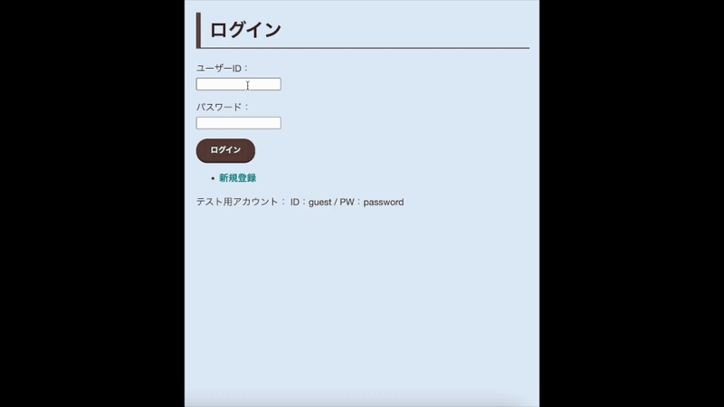
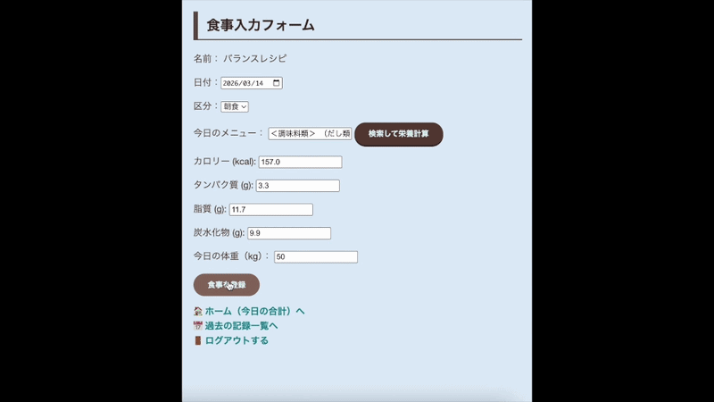

BalanceRecipe


## 概要
これは日々の食事内容を記録し、栄養バランスを確認できるwebアプリケーションです

## 機能
- [機能1: ユーザーログイン・ログアウト・新規ユーザー作成機能]
- [機能2: 食事記録・表示機能]
- [機能3: 栄養素記録・表示機能]

## 使用技術
- **言語**: Java (Servlet/JSP)
- **データベース**: MySQL
- **サーバー**: Apache Tomcat 10.1

## 環境構築・実行手順
1. **データベースの準備**
   MySQLで `balance_recipe_db` というデータベースを作成してください。
   ```sql
   CREATE DATABASE balance_recipe_db;
   ```

## 環境変数の設定
   アプリを動かすには、以下の環境変数を設定してください。
   ※ `DB_PASS` には、ご自身のMySQLのパスワードを設定してください。

   | 名前 | 設定値 |
   | :--- | :--- |
   | **DB_URL** | `jdbc:mysql://localhost/balance_recipe_db?characterEncoding=UTF-8&serverTimezone=Asia/Tokyo&useSSL=false` |
   | **DB_USER** | `root` |
   | **DB_PASS** | **各自のMySQLパスワード** |

## ディレクトリ構成
プロジェクトの構造は以下の通りです。

```text
BalanceRecipe/
├── src/main/java/
│   ├── BalanceRecipe/    # Javaソースコード
│   └── filter/           # フィルタ設定
├── src/main/webapp/
│   ├── css/              # スタイルシート
│   ├── js/               # JavaScriptファイル
│   ├── jsp/              # JSPファイル
│   ├── META-INF/         
│   └── WEB-INF/          
└── README.md
```
## セキュリティへの取り組み
- **XSS攻撃への対策**: ユーザー入力値および表示データにおいて、自作の `Util.replaceEscapeChar` メソッドを通すことで、HTMLインジェクションおよびXSSを防止しています。
- **バリデーション**: 数値入力欄（カロリー、栄養素等）では適切な型変換とエラーハンドリングを行い、不正な入力によるシステムエラーを防止しています。

## 今後の開発予定
   - [ ] 栄養素のグラフ表示機能
   - [ ] 食事記録の編集・削除機能
   - [ ] マイページ追加
   - [ ] 不足栄養素を使用したレシピのレコメンド機能

## アプリデモ動画


