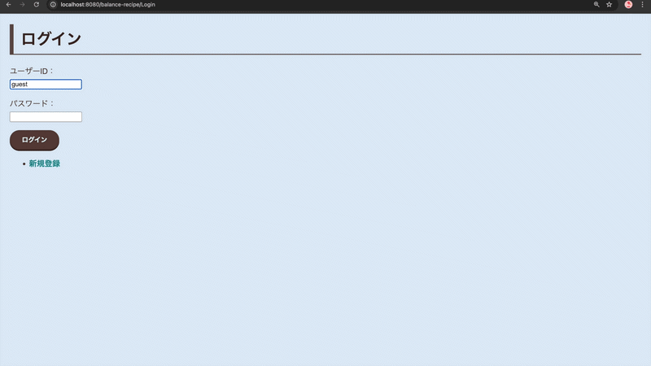
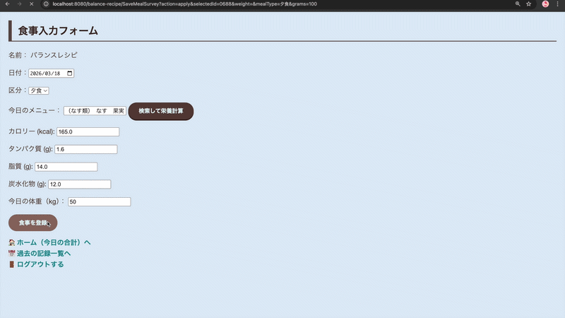

BalanceRecipe


## 概要
これは日々の食事内容を記録し、栄養バランスを確認できるwebアプリケーションです

## 機能
- [機能1: ユーザーログイン・ログアウト・新規ユーザー作成機能]
- [機能2: 食事記録・表示機能]
- [機能3: 栄養素記録・表示機能]

## 使用技術
- **言語**: Java (Servlet/JSP)
- **データベース**: PostgreSQL
- **サーバー**: Apache Tomcat 10.1

## 環境構築・実行手順
1. **データベースの準備**
   PostgreSQLで `balance_recipe_db` というデータベースを作成してください。
   ```sql
   CREATE DATABASE balance_recipe_db;
   ```

2. **テーブルの作成**
	PostgreSQLで以下のテーブルを作成してください。
	ユーザー情報 (USERS) を親とし、そのIDをキーとして食事記録 (meal_logs) を紐付けて管理しています。
	ユーザー情報テーブル (user_info)
	```sql
	CREATE TABLE public."USERS" (
		id varchar(50) NOT NULL,
		"name" varchar(100) NOT NULL,
		"password" varchar(255) NOT NULL,
		birthday date NULL,
		gender bpchar(1) DEFAULT NULL::bpchar NULL,
		height float8 NULL,
		weight float8 NULL,
		target_weight float8 NULL,
		created_at timestamp DEFAULT CURRENT_TIMESTAMP NULL,
		bmi float8 NULL,
		CONSTRAINT "USERS_pkey" PRIMARY KEY (id)
	);
	 ```
	 食品テーブル (food_dictionary)
	 ```sql
	 CREATE TABLE public.food_dictionary (
		id varchar(20) NOT NULL,
		"name" varchar(255) DEFAULT NULL::character varying NULL,
		calories float8 NULL,
		protein float8 NULL,
		fat float8 NULL,
		carbs float8 NULL,
		vit_a float8 NULL,
		vit_d float8 NULL,
		vit_e float8 NULL,
		vit_b1 float8 NULL,
		vit_b2 float8 NULL,
		vit_c float8 NULL,
		salt float8 NULL,
		CONSTRAINT food_dictionary_pkey PRIMARY KEY (id)
	);
	```
	 食事記録テーブル (meal_log)
	 ```sql
	 CREATE TABLE public.meal_logs (
		id serial4 NOT NULL,
		user_id varchar(50) NOT NULL,
		meal_date date NOT NULL,
		meal_type varchar(10) NULL,
		food_name varchar(255) NULL,
		calorie float8 DEFAULT 0 NULL,
		protein float8 DEFAULT 0 NULL,
		fat float8 DEFAULT 0 NULL,
		carbohydrate float8 DEFAULT 0 NULL,
		weight float8 DEFAULT 0 NULL,
		created_at timestamp DEFAULT CURRENT_TIMESTAMP NULL,
		CONSTRAINT meal_logs_pkey PRIMARY KEY (id)
	);
	 ```
 
## 環境変数の設定
   アプリを動かすには、以下の環境変数を設定してください。
   ※ `JDBC_DATABASE_PASSWORD` には、ご自身のPostgreSQLのパスワードを設定してください。

   | 名前 | 設定値 |
   | :--- | :--- |
   | **JDBC_DATABASE_URL** | `jdbc:postgresql://<ホスト名>:5432/balance_recipe_db?sslmode=require` |
   | **JDBC_DATABASE_USERNAME** | `balance_recipe_db_user` |
   | **JDBC_DATABASE_PASSWORD** | **各自のPostgreSQLパスワード** |

## ディレクトリ構成
プロジェクトの構造は以下の通りです。

```text
BalanceRecipe/
├── src/main/java/
│   ├── BalanceRecipe/    # Javaソースコード
│   └── filter/           # フィルタ設定
├── src/main/webapp/
│   ├── css/              # スタイルシート
│   ├── js/               # JavaScriptファイル
│   ├── jsp/              # JSPファイル
│   ├── META-INF/         
│   └── WEB-INF/          
└── README.md
```
## セキュリティへの取り組み
- **XSS攻撃への対策**: ユーザー入力値および表示データにおいて、自作の `Util.replaceEscapeChar` メソッドを通すことで、HTMLインジェクションおよびXSSを防止しています。
- **バリデーション**: 数値入力欄（カロリー、栄養素等）では適切な型変換とエラーハンドリングを行い、不正な入力によるシステムエラーを防止しています。

## 今後の開発予定
   - [ ] 栄養素のグラフ表示機能
   - [ ] 食事記録の編集・削除機能
   - [ ] マイページ追加
   - [ ] 不足栄養素を使用したレシピのレコメンド機能

## アプリデモ動画


